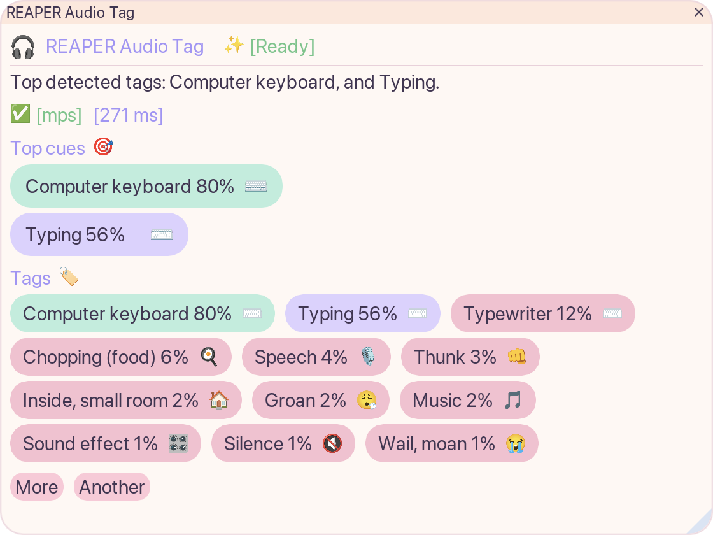

# REAPER Audio Tag

`REAPER Audio Tag` — маленький REAPER action для быстрого анализа отдельных аудио-клипов. Выбираешь один audio item, запускаешь action и получаешь компактные локальные теги `PANNs Cnn14` прямо внутри REAPER.

Устанавливается через ReaPack, ONNX-модель скачивается один раз из окна REAPER, а дальше анализ работает локально без установки Python и без выхода из DAW. После анализа кнопка `Write Tags to Project` может сохранить результат в notes выбранного item и создать соответствующий project region.



_Текущее окно отчёта REAPER Audio Tag: top cues, tag chips, время анализа и статус CPU/GPU._

## Что Нужно

- REAPER с ReaPack.
- ReaImGui из ReaPack.
- Этот репозиторий, импортированный как custom ReaPack repository.

Пользователю больше не нужно ставить Python, создавать venv или вручную выбирать файл модели. Плагин использует self-contained backend, который устанавливается через ReaPack. ONNX-модель скачивается явно при первом запуске и сохраняется в data-папку REAPER.

Модель большая: около 327 MB.

## Установка

1. Установи [ReaPack](https://reapack.com/).
2. В REAPER открой `Extensions -> ReaPack -> Import repositories`.
3. Добавь URL этого репозитория:

```text
https://github.com/dennech/reaper-audio-tag/raw/main/index.xml
```

4. Открой `Extensions -> ReaPack -> Browse packages`.
5. Установи `REAPER Audio Tag`.
6. Если ещё не установлен, установи `ReaImGui: ReaScript binding for Dear ImGui`.
7. Перезапусти REAPER, если ReaPack попросит.

## Первый Запуск

1. Выбери ровно один audio item.
2. Запусти `REAPER Audio Tag`.
3. Нажми `Download Model`.
4. Дождись окончания загрузки и проверки checksum.
5. Запусти `REAPER Audio Tag` снова или нажми `Analyze Selected Item`, если окно ещё открыто.

Модель скачивается из GitHub Release assets этого проекта:

```text
cnn14_waveform_clipwise_opset17.onnx
sha256 deb65c5a2d291b3ce4ebf2360af71072b789ba11a4214ef77406b89ab97333aa
```

Модель сохраняется сюда:

```text
REAPER/Data/reaper-panns-item-report/models/
```

## Платформы

- macOS Apple Silicon и Intel: сначала CoreML, затем CPU fallback.
- Windows x64: сначала DirectML, затем CPU fallback.
- Если GPU acceleration недоступен, анализ всё равно работает на CPU.

Первый запуск CoreML на macOS может быть медленнее, потому что macOS компилирует и кэширует модель.

## Public Actions

- `REAPER Audio Tag`
- `REAPER Audio Tag - Debug Export`

Отдельного Setup или Configure action в публичном пакете больше нет.

## Заметки

- FFmpeg не нужен для текущего public flow.
- После загрузки модели анализ работает локально.
- Текущая версия анализирует один выбранный audio item за раз и делает clip-level tags.
- `Write Tags to Project` создаёт видимый region на длину проанализированного item и сохраняет полный список тегов в notes item. Дорожки не переименовываются.

## Troubleshooting

См. [docs/troubleshooting.ru.md](docs/troubleshooting.ru.md).
